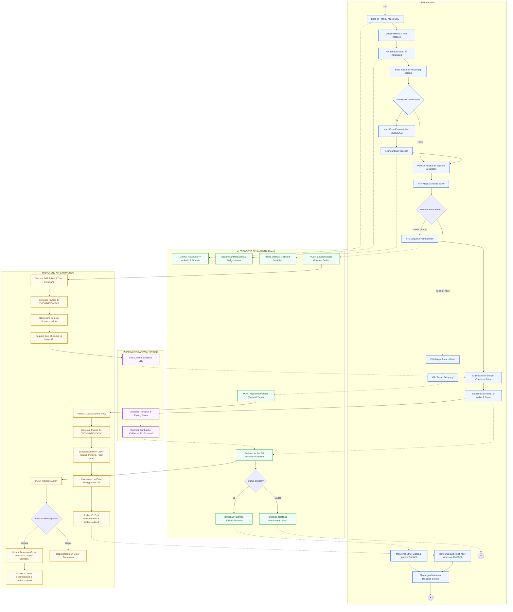
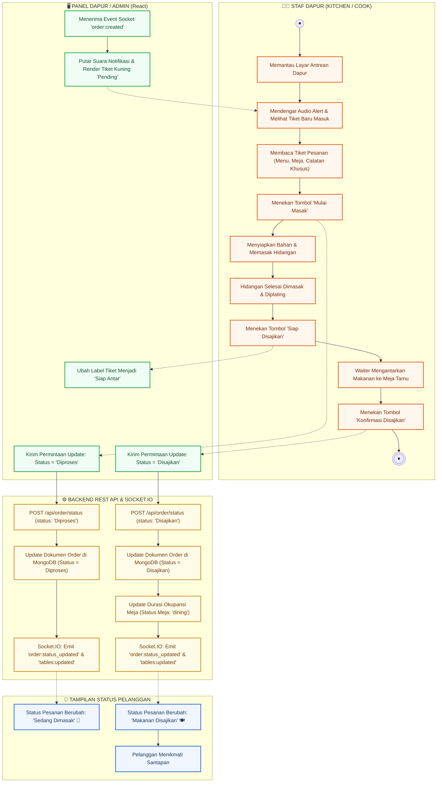
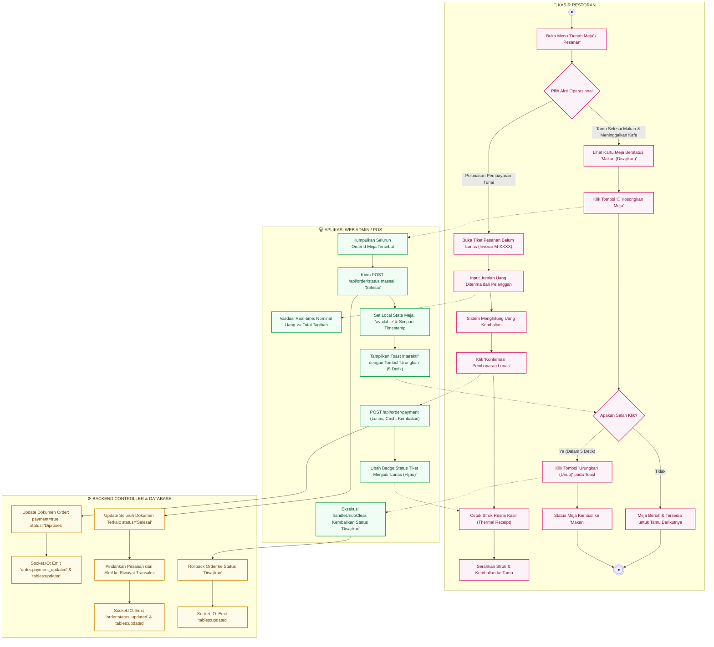
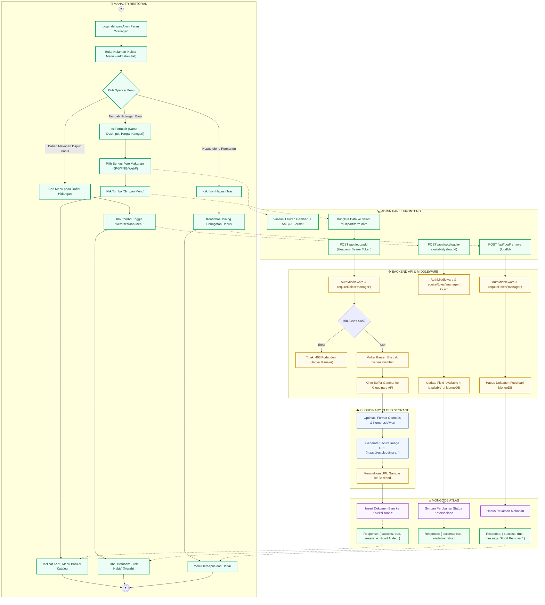

# DOKUMEN ACTIVITY DIAGRAM & SPESIFIKASI ALUR KERJA SISTEM
## SISTEM APLIKASI PEMESANAN MENU & POS RESTORAN (BUJANG CAFE)

---

### Informasi Dokumen
- **Judul Proyek**: Sistem Informasi Pemesanan Menu Digital & Point of Sale (POS) Bujang Cafe
- **Penyusun**: Mahasiswa Tugas Akhir
- **Standar Pemodelan**: Unified Modeling Language (UML 2.5)
- **Tingkat Diagram**: Business Process & System Dynamic Workflow with Swimlanes (Partitioning)
- **Tanggal Rilis**: 27 September 2026
- **Status**: Final Disetujui

---

## 1. PENDAHULUAN

Activity Diagram adalah diagram perilaku (*behavioral diagram*) dalam UML yang menggambarkan alur kerja (*workflow*) berurutan, percabangan keputusan (*decision*), penggabungan alur (*merge*), konkurensi/paralelisme (*fork & join*), serta pembagian tanggung jawab antar entitas sistem menggunakan jalur renang (*swimlanes/partitions*).

Pada sistem **Bujang Cafe POS & Restoran**, pemodelan aktivitas disusun ke dalam **4 Alur Proses Bisnis Utama**:
1. **Activity Diagram 1: Alur Pemesanan Menu & Checkout oleh Pelanggan** (Mendukung Pembayaran Online Stripe & Tunai di Kasir).
2. **Activity Diagram 2: Alur Pemrosesan Pesanan Dapur & Penyajian** (Siklus Status Masak, Sajikan, hingga Update Meja).
3. **Activity Diagram 3: Alur Kasir, Pelunasan Tunai, & Okupansi Meja** (Mencakup Fitur Unggulan *1-Click Kosongkan Meja* & *Undo*).
4. **Activity Diagram 4: Alur Manajemen Katalog Menu & Ketersediaan Stok oleh Manajer** (Integrasi Cloudinary & Penyesuaian Real-time).

---

## 2. NOTASI STANDAR UML 2.5 PADA ACTIVITY DIAGRAM

| Simbol / Notasi | Nama Simbol | Deskripsi & Fungsi |
| :---: | :--- | :--- |
| `((●))` | **Initial Node** | Titik awal dimulainya suatu alur kerja atau skenario aktivitas. |
| `(((●)))` | **Activity Final Node** | Titik akhir pemberhentian seluruh alur kerja dalam diagram. |
| `[Aktivitas]` | **Action / Activity** | Tindakan komputasi atau aktivitas yang dilakukan oleh aktor/sistem. |
| `◇` | **Decision Node** | Titik percabangan yang memiliki satu masukan dan beberapa keluaran berlabel kondisi (*guard condition*). |
| `◇` | **Merge Node** | Titik penggabungan beberapa alur alternatif kembali menjadi satu alur utama. |
| `====` | **Fork Node** | Memecah satu aliran kontrol menjadi dua atau lebih aliran yang berjalan secara simultan (paralel). |
| `====` | **Join Node** | Menyatukan kembali aliran-aliran paralel sebelum melangkah ke aktivitas berikutnya. |
| `|Swimlane|` | **Partition / Swimlane** | Mengelompokkan aktivitas berdasarkan aktor penanggung jawab atau komponen subsistem. |

---

## 3. DIAGRAM 1: ALUR PEMESANAN MENU & CHECKOUT OLEH PELANGGAN

Diagram ini memodelkan proses dari awal tamu memindai QR Code di meja atau membuka web browser, memilih hidangan, menerapkan voucher promo, hingga melakukan pelunasan tagihan baik melalui **Stripe Payment Gateway** maupun **Pembayaran Tunai di Kasir**.

---

### Spesifikasi Alur Kerja: Pemesanan Menu & Checkout

| Atribut Skenario | Keterangan Rinci |
| :--- | :--- |
| **Aktor Utama** | Pelanggan (*Customer*) |
| **Aktor Pendukung** | Payment Gateway Stripe, Server Backend Bujang Cafe |
| **Kondisi Awal (*Pre-condition*)** | Pelanggan berada di meja makan kafe dan memiliki koneksi internet pada perangkat ponsel/laptop. Menu makanan telah aktif di basis data. |
| **Kondisi Akhir (*Post-condition*)** | Dokumen pesanan berhasil dicatat di basis data MongoDB, keranjang belanja dikosongkan, invoice diterbitkan, dan event WebSocket memicu peringatan pesanan baru di panel kasir serta dapur. |

#### Alur Aktivitas Normal (*Happy Path*):
1. **Pindai QR / Pilih Meja**: Pelanggan memindai QR Code akrilik di meja. Sistem frontend membaca parameter query `table` secara otomatis.
2. **Katalog & Keranjang**: Pelanggan memilih hidangan, menentukan porsi, dan memasukkan ke dalam keranjang.
3. **Penerapan Voucher (Opsional)**: Pelanggan memasukkan kode promo (contoh: `MERDEKA` diskon 30% atau `SPECIAL20` diskon 20%). Sistem menghitung total bersih.
4. **Pemilihan Jalur Pembayaran**:
   - **Opsi A (Online via Stripe)**:
     1. Frontend mengirim data ke endpoint `/api/order/place`.
     2. Backend menerbitkan kode invoice `E-YYYYMMDD-XXXX` dan mendaftarkan sesi checkout ke Stripe.
     3. Pelanggan memasukkan detail kartu/e-wallet dan menyelesaikan otorisasi.
     4. Stripe mengarahkan kembali ke halaman `/verify?success=true`.
     5. Backend memperbarui pesanan menjadi lunas (`payment: true`) dan status langsung melompat ke `Diproses`.
     6. WebSocket memancarkan sinyal `order:created` ke seluruh layar staf.
   - **Opsi B (Tunai di Kasir)**:
     1. Pelanggan memilih metode "Tunai di Kasir" dan menekan tombol "Pesan Sekarang".
     2. Frontend mengirim permintaan ke endpoint `/api/order/manual`.
     3. Backend menerbitkan kode invoice `M-YYYYMMDD-XXXX`, menyimpan pesanan dengan status `Pending` dan `payment: false`.
     4. WebSocket memancarkan sinyal `order:created` ke layar kasir dan dapur.
     5. Pelanggan menerima bukti tiket digital untuk dibawa ke kasir.

#### Alur Alternatif & Penanganan Kesalahan (*Alternative Paths*):
- **A1: Saldo Pembayaran Online Tidak Cukup / Dibatalkan**: Stripe mengarahkan ke `/verify?success=false`. Backend menghapus draf order sementara, frontend menampilkan peringatan transaksi dibatalkan, dan item di keranjang dapat dipesan ulang.
- **A2: Kode Promo Tidak Valid / Kedaluwarsa**: Frontend menampilkan notifikasi gagal dan nilai potongan diskon di-reset menjadi Rp 0.

---

## 4. DIAGRAM 2: ALUR PEMROSESAN PESANAN DAPUR & PENYAJIAN (KITCHEN WORKFLOW)

Diagram ini memodelkan siklus operasional staf dapur (*chef/cook*) dalam menerima pesanan, memulai proses memasak, menyelesaikan racikan hidangan, hingga mengantarkan pesanan ke meja pelanggan.

---

### Spesifikasi Alur Kerja: Pemrosesan Dapur & Penyajian

| Atribut Skenario | Keterangan Rinci |
| :--- | :--- |
| **Aktor Utama** | Staf Dapur (*Chef/Cook*) & Waiter |
| **Aktor Pendukung** | Sistem Real-Time Socket.IO, Pelanggan |
| **Kondisi Awal (*Pre-condition*)** | Pesanan telah masuk ke sistem baik melalui transaksi online maupun pesanan tunai dari meja. |
| **Kondisi Akhir (*Post-condition*)** | Status pesanan di database bertransisi dari `Pending` → `Diproses` → `Disajikan`. Meja makan tercatat aktif terisi (*Dining State*). |

#### Alur Aktivitas Normal (*Happy Path*):
1. **Deteksi Pesanan Masuk**: Socket.IO memancarkan event `order:created`. Layar antrean dapur otomatis berdering dan menampilkan kartu pesanan baru berwarna kuning.
2. **Review Rincian**: Koki membaca nomor meja, daftar menu yang dipesan, serta catatan khusus (misal: "Pedas sedikit, es dipisah").
3. **Mulai Memasak**: Koki menekan tombol "Mulai Masak". Sistem backend memperbarui status order menjadi `Diproses` dan otomatis menyiarkan status terkini ke gawai pelanggan.
4. **Penyelesaian & Plating**: Makanan selesai diracik dan ditata di nampan saji.
5. **Pengantaran ke Meja**: Waiter mengantarkan hidangan ke nomor meja tamu dan staf menekan "Konfirmasi Disajikan".
6. **Sinkronisasi Denah Meja**: Backend mengubah status order menjadi `Disajikan`. Pada denah kasir, meja bertransisi ke status `dining` (sedang makan) dan pengukur waktu makan (*dining timer*) mulai dihitung.

---

## 5. DIAGRAM 3: ALUR KASIR, PELUNASAN TUNAI, & OKUPANSI MEJA (1-CLICK KOSONGKAN MEJA)

Diagram ini memodelkan fungsi inti kasir dalam mengelola pembayaran tunai, mencetak invoice struk, memantau denah meja restoran, serta mengeksekusi fitur unggulan **1-Click Kosongkan Meja** dengan pengamanan pembatalan (*Undo*).

---

### Spesifikasi Alur Kerja: Kasir & Siklus Meja (*Table Lifecycle*)

| Atribut Skenario | Keterangan Rinci |
| :--- | :--- |
| **Aktor Utama** | Kasir (*Cashier*) |
| **Aktor Pendukung** | Sistem POS Bujang Cafe, Database MongoDB |
| **Kondisi Awal (*Pre-condition*)** | Kasir terautentikasi dan login ke panel POS. Pelanggan telah memiliki pesanan tunai aktif atau telah selesai makan di meja. |
| **Kondisi Akhir (*Post-condition*)** | Status pembayaran pesanan terverifikasi lunas, struk tercetak, dan meja berhasil dikosongkan (`status: available`) sehingga siap digunakan tamu berikutnya. |

#### Alur Aktivitas Normal (*Happy Path*):
1. **Pelunasan Tunai di Meja Kasir**:
   - Pelanggan mendatangi meja kasir menyebutkan nomor meja atau memperlihatkan kode invoice `M-YYYYMMDD-XXXX`.
   - Kasir membuka modal pembayaran, memasukkan nominal uang tunai yang diserahkan pelanggan.
   - Sistem secara otomatis menghitung selisih uang kembalian (*change*).
   - Kasir menekan tombol "Konfirmasi Pembayaran Lunas".
   - Backend memperbarui `payment = true` dan mengalihkan status order yang sebelumnya `Pending` menjadi `Diproses`.
   - Struk tagihan tercetak via printer thermal.
2. **Operasional 1-Click Kosongkan Meja**:
   - Ketika tamu telah selesai makan dan meninggalkan meja, kasir membuka tab **Manajemen Meja**.
   - Kartu meja menampilkan durasi santap tamu dan status `Makan (Disajikan)`.
   - Kasir mengklik tombol **"🧹 Kosongkan Meja"**.
   - Sistem frontend mengumpulkan seluruh ID pesanan aktif pada meja tersebut dan menembak endpoint `/api/order/status` dengan status `Selesai`.
   - Dokumen pesanan otomatis diarsipkan ke tab Riwayat Pesanan dan status kartu meja seketika berubah menjadi hijau (`Kosong/Available`).
   - Sistem menampilkan toast konfirmasi selama 5 detik: *"Meja X dikosongkan & status selesai 🧹"* disertai tombol interaktif **"Urungkan"**.

#### Alur Alternatif: Pembatalan Pengosongan Meja (*Undo Clear Table*):
- Jika kasir tidak sengaja menekan tombol "Kosongkan Meja" padahal tamu masih berada di meja, kasir memiliki batas waktu 5 detik untuk menekan tombol **"Urungkan"** pada toast notifikasi.
- Sistem mengeksekusi fungsi `handleUndoClear`: memulihkan status pesanan kembali menjadi `Disajikan` di database, membatalkan penanda timestamp lokal, dan mengembalikan kartu meja ke kondisi `Makan (Dining)`.

---

## 6. DIAGRAM 4: ALUR MANAJEMEN KATALOG MENU & STOK OLEH MANAJER

Diagram ini memodelkan hak akses eksklusif **Manajer / Administrator** dalam menambah hidangan baru, memperbarui informasi harga/kategori, mengunggah foto produk ke server awan **Cloudinary**, serta mengubah ketersediaan menu (*stock toggle*).

---

### Spesifikasi Alur Kerja: Manajemen Menu & Stok Makanan

| Atribut Skenario | Keterangan Rinci |
| :--- | :--- |
| **Aktor Utama** | Manajer Restoran (*Restaurant Manager*) |
| **Aktor Pendukung** | Penyedia Cloudinary Storage, Database MongoDB |
| **Kondisi Awal (*Pre-condition*)** | Manajer telah login dengan kredensial sah dan mengantongi token JWT dengan hak akses `role: 'manager'`. |
| **Kondisi Akhir (*Post-condition*)** | Data katalog menu bertambah/berubah di MongoDB, aset gambar tersimpan di CDN Cloudinary, dan pelanggan langsung melihat perubahan ketersediaan menu secara real-time. |

#### Alur Aktivitas Normal (*Happy Path*):
1. **Penambahan Menu Baru**:
   - Manajer membuka halaman "Tambah Menu", melengkapi nama hidangan, deskripsi, harga porsi, kategori (Salad, Pasta, Cakes, dll.), dan mengunggah berkas foto.
   - Backend memverifikasi tanda tangan JWT dan hak izin peran melalui `requireRoles('manager')`.
   - File gambar diunggah ke CDN Cloudinary untuk menghasilkan URL publik yang terenkripsi aman (*HTTPS*).
   - Backend menyimpan rekaman dokumen hidangan ke koleksi `foods` di MongoDB dengan atribut `available = true`.
   - Katalog menu di aplikasi pelanggan langsung menampilkan hidangan baru tersebut.
2. **Pengalihan Status Ketersediaan (Stok Habis / Ready)**:
   - Ketika bahan makanan tertentu di dapur habis, staf kasir atau manajer menekan tombol toggle ketersediaan pada daftar menu.
   - Backend mengeksekusi `/api/food/toggle-availability` dan membalik nilai boolean `available`.
   - Di aplikasi pelanggan, tombol "Tambah ke Keranjang" untuk menu tersebut otomatis dinonaktifkan dan diganti dengan lencana *"Stok Habis"*, mencegah pelanggan memesan menu yang tidak dapat disajikan.

---

## 7. MATRIKS KETERHUBUNGAN DOKUMEN TUGAS AKHIR

Dokumen Activity Diagram ini menyatu secara komprehensif dengan seluruh pilar dokumentasi rekayasa perangkat lunak sistem Bujang Cafe:

| Dokumen | Format & Tautan Berkas | Fokus Pemodelan / Pengujian |
| :--- | :--- | :--- |
| **Activity Diagram** | **[ACTIVITY_DIAGRAM.md](file:///d:/College/Tugas%20Sopiansyah/Tugas%20Akhir/menu-ordering-app-deploy/ACTIVITY_DIAGRAM.md)** | **Alur kerja dinamis sistem (Dynamic Workflow)**, percabangan keputusan, partisi swimlanes antar aktor, dan penanganan kondisi gagal. |
| **Class Diagram** | **[CLASS_DIAGRAM.md](file:///d:/College/Tugas%20Sopiansyah/Tugas%20Akhir/menu-ordering-app-deploy/CLASS_DIAGRAM.md)** | **Struktur statis sistem (Static Structure)**, relasi kelas, komposisi `Order` ke `OrderItem`, dan arsitektur berlapis MVC Express.js. |
| **Use Case Diagram** | **[USE_CASE_DIAGRAM.md](file:///d:/College/Tugas%20Sopiansyah/Tugas%20Akhir/menu-ordering-app-deploy/USE_CASE_DIAGRAM.md)** | **Perspektif fungsional aktor (Functional View)**, mendefinisikan 28 use case dengan relasi `<<include>>` dan `<<extend>>`. |
| **Black Box Testing Admin** | **[BLACK_BOX_TESTING_ADMIN.md](file:///d:/College/Tugas%20Sopiansyah/Tugas%20Akhir/menu-ordering-app-deploy/BLACK_BOX_TESTING_ADMIN.md)** | **Pengujian fungsional manual panel staf** (84 test cases mencakup fitur Kosongkan Meja, Kasir, Dapur, & Manajer). |
| **Black Box Testing Customer** | **[BLACK_BOX_TESTING_CUSTOMER.md](file:///d:/College/Tugas%20Sopiansyah/Tugas%20Akhir/menu-ordering-app-deploy/BLACK_BOX_TESTING_CUSTOMER.md)** | **Pengujian fungsional manual pelanggan** (54 test cases mencakup QR, Keranjang, Voucher, & Pembayaran). |
| **Laporan Uji Otomatis** | **[tests/reports/index.html](file:///d:/College/Tugas%20Sopiansyah/Tugas%20Akhir/menu-ordering-app-deploy/tests/reports/index.html)** | **Bukti empiris pengujian otomatis** (Jest Unit + Supertest API + Playwright E2E, 55/55 passed, 100%). |
