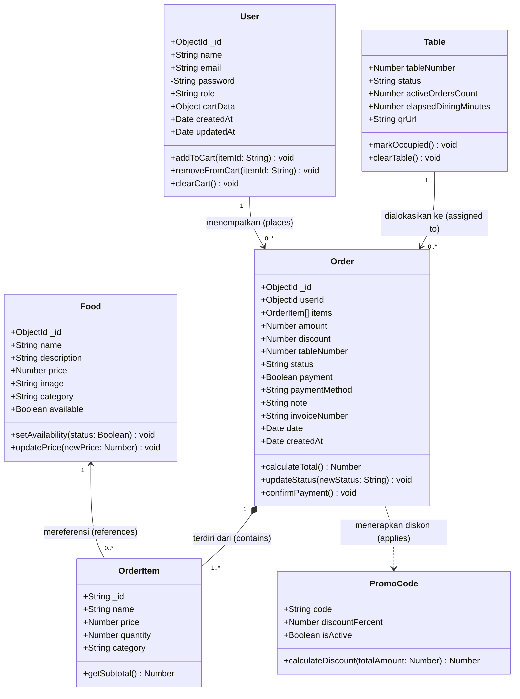

# DOKUMEN CLASS DIAGRAM & SPESIFIKASI ARSITEKTUR KELAS
## SISTEM APLIKASI PEMESANAN MENU & POS RESTORAN (BUJANG CAFE)

---

### Informasi Dokumen
- **Judul Proyek**: Sistem Informasi Pemesanan Menu Digital & Point of Sale (POS) Bujang Cafe
- **Penyusun**: Mahasiswa Tugas Akhir
- **Standar Pemodelan**: Unified Modeling Language (UML 2.5)
- **Tingkat Diagram**: Kombinasi (Entity Domain Model & Layered Architecture Diagram)
- **Tanggal Rilis**: 27 September 2026
- **Status**: Final Disetujui

---

## 1. PENDAHULUAN

Class Diagram adalah salah satu diagram struktural utama dalam *Unified Modeling Language* (UML) yang menggambarkan struktur statis sistem dengan memodelkan kelas-kelas (*classes*), atribut (*attributes*), metode (*methods/operations*), serta hubungan relasi antar kelas seperti asosiasi, agregasi, komposisi, dependensi, dan generalisasi.

Pada sistem **Bujang Cafe POS & Restoran**, pemodelan kelas dibagi menjadi 2 sudut pandang komplementer:
1. **Domain / Entity-Level Class Diagram**: Memodelkan struktur entitas data inti di database MongoDB, tipe data, kardinalitas (*multiplicity*), dan keterikatan komposisi objek bisnis.
2. **Design-Level / Layered Architecture Class Diagram**: Memodelkan arsitektur perangkat lunak berbasis MVC (*Model-View-Controller*) di sisi backend Node.js & Express, mencakup Controllers, Routers, Middlewares, serta integrasi layanan eksternal (*Socket.IO, Stripe, Cloudinary*).

---

## 2. DIAGRAM 1: DOMAIN / ENTITY-LEVEL CLASS DIAGRAM

Diagram ini merepresentasikan struktur skema basis data (*database schema*) dan relasi kardinalitas objek transaksi restoran.

---

## 3. DIAGRAM 2: DESIGN-LEVEL / LAYERED ARCHITECTURE CLASS DIAGRAM

Diagram ini memodelkan arsitektur berlapis (*layered architecture*) Express.js yang menghubungkan **Client Routers**, **Middlewares**, **Controllers**, **Data Models**, dan **External Services**.

```mermaid
classDiagram
    direction TB

    %% ──────────────────────────────────────────────────────────
    %% ROUTERS & MIDDLEWARES
    %% ──────────────────────────────────────────────────────────
    class AuthMiddleware {
        +authMiddleware(req, res, next) Promise~void~
        +requireRoles(...allowedRoles: String[]) Function
    }

    class UserRouter {
        +post("/register")
        +post("/login")
        +post("/admin-login")
        +get("/admin-check")
    }

    class FoodRouter {
        +get("/list")
        +post("/add")
        +post("/update")
        +post("/remove")
        +post("/toggle-availability")
    }

    class OrderRouter {
        +post("/place")
        +post("/manual")
        +get("/list")
        +get("/tables")
        +post("/status")
        +post("/payment")
        +post("/userorders")
    }

    class CartRouter {
        +post("/add")
        +post("/remove")
        +post("/get")
    }

    %% ──────────────────────────────────────────────────────────
    %% CONTROLLERS
    %% ──────────────────────────────────────────────────────────
    class UserController {
        +registerUser(req, res) Promise~void~
        +loginUser(req, res) Promise~void~
        +adminLogin(req, res) Promise~void~
        +adminCheck(req, res) Promise~void~
        -createToken(id: String, role: String) String
    }

    class FoodController {
        +addFood(req, res) Promise~void~
        +listFood(req, res) Promise~void~
        +removeFood(req, res) Promise~void~
        +updateFood(req, res) Promise~void~
        +toggleAvailability(req, res) Promise~void~
    }

    class OrderController {
        +placeOrder(req, res) Promise~void~
        +placeManualOrder(req, res) Promise~void~
        +getOrderById(req, res) Promise~void~
        +verifyOrder(req, res) Promise~void~
        +userOrders(req, res) Promise~void~
        +listOrders(req, res) Promise~void~
        +getTableOrders(req, res) Promise~void~
        +updateStatus(req, res) Promise~void~
        +updatePayment(req, res) Promise~void~
        -generateInvoiceNumber(type: String) String
    }

    class CartController {
        +addToCart(req, res) Promise~void~
        +removeFromCart(req, res) Promise~void~
        +getCart(req, res) Promise~void~
    }

    %% ──────────────────────────────────────────────────────────
    %% MODELS (DATA LAYER)
    %% ──────────────────────────────────────────────────────────
    class UserModel {
        <<Mongoose Model>>
        +find()
        +findById()
        +findOne()
        +create()
        +findByIdAndUpdate()
    }

    class FoodModel {
        <<Mongoose Model>>
        +find()
        +findById()
        +create()
        +findByIdAndDelete()
    }

    class OrderModel {
        <<Mongoose Model>>
        +find()
        +findById()
        +create()
        +findByIdAndUpdate()
    }

    %% ──────────────────────────────────────────────────────────
    %% EXTERNAL SERVICES & ADAPTERS
    %% ──────────────────────────────────────────────────────────
    class SocketIOService {
        <<WebSocket Broadcast>>
        +io: Server
        +emitOrderCreated(orderPayload) void
        +emitTablesUpdated() void
        +emitStatusChanged(orderId, status) void
    }

    class StripeService {
        <<Payment Gateway>>
        -stripeKey: String
        +createCheckoutSession(items, returnUrl) Promise~Session~
    }

    class CloudinaryService {
        <<Cloud Storage>>
        +uploadImage(fileBuffer) Promise~String~
        +deleteImage(publicId) Promise~void~
    }

    %% ──────────────────────────────────────────────────────────
    %% DEPENDENCIES & INVOCATIONS
    %% ──────────────────────────────────────────────────────────
    UserRouter ..> AuthMiddleware : menggunakan
    FoodRouter ..> AuthMiddleware : memproteksi peran
    OrderRouter ..> AuthMiddleware : memvalidasi token
    CartRouter ..> AuthMiddleware : memvalidasi user

    UserRouter --> UserController : mendistribusikan
    FoodRouter --> FoodController : mendistribusikan
    OrderRouter --> OrderController : mendistribusikan
    CartRouter --> CartController : mendistribusikan

    UserController ..> UserModel : manipulasi data
    CartController ..> UserModel : update cartData
    FoodController ..> FoodModel : manipulasi data
    OrderController ..> OrderModel : manipulasi data
    OrderController ..> UserModel : update cart & cek nama

    FoodController ..> CloudinaryService : unggah gambar menu
    OrderController ..> StripeService : buat sesi pembayaran
    OrderController ..> SocketIOService : broadcast POS real-time
```

---

## 4. KAMUS DATA & SPESIFIKASI DETAIL KELAS

### 4.1 Entitas `User`
Kelas entitas untuk menyimpan informasi akun pengguna (baik pelanggan umum maupun staf pengelola restoran).

| Atribut / Method | Visibilitas | Tipe Data | Deskripsi |
| :--- | :---: | :--- | :--- |
| `_id` | `+` (Public) | `ObjectId` | Identitas unik (*primary key*) dokumen pengguna di MongoDB. |
| `name` | `+` (Public) | `String` | Nama lengkap pengguna / staf. |
| `email` | `+` (Public) | `String` | Alamat surel unik pengguna (*lowercase, normalized*). |
| `password` | `-` (Private) | `String` | Hash kata sandi terenkripsi menggunakan algoritma bcrypt (salt: 10). |
| `role` | `+` (Public) | `Enum` | Peran hak akses: `'user'`, `'kasir'`, `'manager'`, `'admin'`, `'kitchen'`. |
| `cartData` | `+` (Public) | `Object` | Pasangan kunci-nilai ID makanan dan jumlah porsi belanja pelanggan. |
| `createdAt` | `+` (Public) | `Date` | Stempel waktu pembuatan akun pengguna. |
| `addToCart(itemId)` | `+` (Public) | `void` | Menambah jumlah kuantitas menu tertentu ke dalam keranjang. |
| `removeFromCart(itemId)` | `+` (Public) | `void` | Mengurangi porsi atau menghapus menu dari keranjang. |
| `clearCart()` | `+` (Public) | `void` | Mengosongkan seluruh keranjang setelah checkout pesanan berhasil. |

---

### 4.2 Entitas `Food`
Kelas entitas katalog makanan dan minuman yang ditawarkan oleh restoran Bujang Cafe.

| Atribut / Method | Visibilitas | Tipe Data | Deskripsi |
| :--- | :---: | :--- | :--- |
| `_id` | `+` (Public) | `ObjectId` | Identitas unik hidangan. |
| `name` | `+` (Public) | `String` | Nama menu makanan/minuman (misal: "Kopi Bujang Spesial"). |
| `description` | `+` (Public) | `String` | Deskripsi cita rasa dan komposisi hidangan. |
| `price` | `+` (Public) | `Number` | Harga jual per porsi dalam mata uang Rupiah (IDR). |
| `image` | `+` (Public) | `String` | URL berkas foto menu di penyimpanan awan Cloudinary. |
| `category` | `+` (Public) | `String` | Kategori hidangan (Salad, Rolls, Deserts, Sandwich, Cake, Pure Veg, Pasta, Noodles). |
| `available` | `+` (Public) | `Boolean` | Status ketersediaan bahan (*True: Tersedia, False: Stok Habis*). |
| `setAvailability(status)` | `+` (Public) | `void` | Memperbarui status ketersediaan bahan dapur. |
| `updatePrice(newPrice)` | `+` (Public) | `void` | Mengubah harga jual menu oleh Manajer. |

---

### 4.3 Entitas `Order` & `OrderItem`
Kelas komposit yang merekam transaksi pemesanan hidangan di restoran.

#### Atribut `Order`
| Atribut / Method | Visibilitas | Tipe Data | Deskripsi |
| :--- | :---: | :--- | :--- |
| `_id` | `+` (Public) | `ObjectId` | Identitas unik transaksi pesanan. |
| `userId` | `+` (Public) | `ObjectId` | Referensi foreign key ke pengguna (`User._id`) pembuat pesanan. |
| `items` | `+` (Public) | `OrderItem[]` | Daftar rincian makanan yang dipesan (**Relasi Komposisi**). |
| `amount` | `+` (Public) | `Number` | Total tagihan bersih setelah dipotong diskon (dalam Rupiah). |
| `discount` | `+` (Public) | `Number` | Nilai nominal potongan diskon dari voucher promo. |
| `tableNumber` | `+` (Public) | `Number` | Nomor meja fisik tempat tamu duduk (1 s/d total meja). |
| `status` | `+` (Public) | `Enum` | Progres pesanan: `'Pending'`, `'Dimasak'`, `'Disajikan'`, `'Selesai'`, `'Dibatalkan'`. |
| `payment` | `+` (Public) | `Boolean` | Status pelunasan tagihan (*True: Lunas, False: Belum Bayar*). |
| `paymentMethod` | `+` (Public) | `Enum` | Metode bayar: `'Tunai'`, `'Elektronik'`, `'Online'`. |
| `note` | `+` (Public) | `String` | Catatan khusus pesanan (misal: "Es dipisah, sedikit gula"). |
| `invoiceNumber` | `+` (Public) | `String` | Kode struk resmi: `E-YYYYMMDD-XXXX` (online) atau `M-YYYYMMDD-XXXX` (tunai). |
| `date` | `+` (Public) | `Date` | Waktu transaksi dibuat. |
| `calculateTotal()` | `+` (Public) | `Number` | Menghitung total biaya: `Σ(subtotal item) - discount`. |
| `updateStatus(status)` | `+` (Public) | `void` | Memperbarui tahapan siklus hidup pesanan. |
| `confirmPayment()` | `+` (Public) | `void` | Mengubah status pembayaran menjadi lunas (`payment = true`). |

#### Atribut `OrderItem`
| Atribut / Method | Visibilitas | Tipe Data | Deskripsi |
| :--- | :---: | :--- | :--- |
| `_id` | `+` (Public) | `String` | ID referensi menu makanan. |
| `name` | `+` (Public) | `String` | Nama hidangan pada saat transaksi terjadi. |
| `price` | `+` (Public) | `Number` | Harga satuan saat transaksi dibuat (*snapshot price*). |
| `quantity` | `+` (Public) | `Number` | Jumlah porsi yang dipesan. |
| `getSubtotal()` | `+` (Public) | `Number` | Hasil perkalian kuantitas dengan harga satuan: `price * quantity`. |

---

### 4.4 Entitas `Table` (Manajemen Okupansi Meja)
Model domain yang mengelola ketersediaan meja makan dan stand akrilik QR Code.

| Atribut / Method | Visibilitas | Tipe Data | Deskripsi |
| :--- | :---: | :--- | :--- |
| `tableNumber` | `+` (Public) | `Number` | Angka pengenal meja fisik (Meja 1, 2, 3, dst.). |
| `status` | `+` (Public) | `Enum` | Kondisi meja: `'available'` (kosong), `'pending'` (menunggu konfirmasi), `'cooking'` (dimasak di dapur), `'dining'` (disajikan/tamu sedang makan). |
| `activeOrdersCount` | `+` (Public) | `Number` | Jumlah pesanan aktif yang terkait dengan meja tersebut. |
| `elapsedDiningMinutes` | `+` (Public) | `Number` | Durasi waktu tamu telah menduduki meja (dalam menit). |
| `qrUrl` | `+` (Public) | `String` | Tautan URL scan meja: `${frontendUrl}/?table=${tableNumber}`. |
| `clearTable()` | `+` (Public) | `void` | **Fitur 1-Click Kosongkan Meja**: Menyelesaikan seluruh pesanan meja di backend dan menandai meja siap tamu baru. |

---

### 4.5 Kelas Layanan & Middleware Backend

#### 1. `AuthMiddleware`
- `authMiddleware(req, res, next)`: Memvalidasi keberadaan token JWT pada header `authorization` atau `token`. Melakukan verifikasi *signature* dengan secret key dan menginjeksi identitas `req.user = { id, role }`.
- `requireRoles(...allowedRoles)`: Pemeriksaan keamanan berbasis peran (RBAC). Menormalkan peran `admin` ke hak `manager`. Jika peran pengguna tidak memenuhi kriteria izin, sistem mengembalikan kode HTTP `403 Forbidden`.

#### 2. `OrderController`
- `placeManualOrder(req, res)`: Menangani pesanan kasir/tunai dari meja makan, menghasilkan kode invoice berawalan `M-`, membersihkan keranjang, dan memancarkan event `order:created` ke WebSocket.
- `updateStatus(req, res)`: Memperbarui status pesanan menjadi *Dimasak*, *Disajikan*, *Selesai*, atau *Dibatalkan*.
- `updatePayment(req, res)`: Mengonfirmasi pembayaran tunai oleh kasir menjadi `payment = true`.

#### 3. `SocketIOService` (Real-Time Push Notification)
- `emitOrderCreated(payload)`: Menyiarkan notifikasi instan ke layar kasir dan dapur saat pesanan baru masuk tanpa perlu memuat ulang (*refresh*) browser.
- `emitTablesUpdated()`: Memperbarui denah okupansi meja kasir secara langsung saat terjadi transaksi baru atau pengosongan meja.

---

## 5. PENJELASAN HUBUNGAN ANTAR KELAS (RELATIONSHIPS)

| Hubungan Relasi | Jenis Hubungan UML | Notasi | Penjelasan Arsitektur |
| :--- | :---: | :---: | :--- |
| **User ke Order** | Asosiasi (*Association*) | `1 --> 0..*` | Satu akun pengguna dapat membuat nol atau banyak transaksi pesanan seiring waktu. Setiap pesanan wajib memiliki satu pemilik akun `userId`. |
| **Order ke OrderItem** | Komposisi (*Composition*) | `1 *-- 1..*` | Setiap pesanan wajib memiliki minimal satu item pesanan. Jika dokumen induk `Order` dihapus, seluruh rincian `OrderItem` di dalamnya turut terhapus (*lifecycle dependency*). |
| **Food ke OrderItem** | Asosiasi (*Association*) | `1 <-- 0..*` | Suatu menu hidangan dapat dipesan berulang kali di berbagai pesanan melalui `OrderItem` yang merekam salinan harga (*price snapshot*). |
| **Table ke Order** | Asosiasi (*Association*) | `1 --> 0..*` | Meja makan menampung pesanan berdasarkan nomor meja (`tableNumber`). Satu meja dapat memiliki beberapa pesanan aktif (pesanan susulan/multi-order). |
| **Order ke PromoCode** | Dependensi (*Dependency*) | `..>` | Pesanan bergantung secara kondisional pada validasi kode voucher promo (`MERDEKA` 30%, `SPECIAL20` 20%) untuk memotong total tagihan. |
| **Routers ke Controllers** | Dependensi Eksekusi | `-->` | Router Express bertindak sebagai pintu masuk URL dan mendelegasikan pemrosesan logika bisnis ke metode controller terkait. |
| **Controllers ke Models** | Dependensi Data | `..>` | Controller berinteraksi langsung dengan skema Mongoose ODM untuk melakukan operasi CRUD pada basis data MongoDB. |
| **Controllers ke Services** | Agregasi Eksternal | `..>` | Controller memanfaatkan adaptor pihak ketiga seperti Stripe untuk pembayaran kartu, Cloudinary untuk penyimpanan foto, dan Socket.IO untuk komunikasi real-time. |

---

## 6. KETERHUBUNGAN DENGAN DOKUMEN TUGAS AKHIR LAINNYA

Dokumen Class Diagram ini melengkapi pilar dokumentasi rekayasa perangkat lunak sistem Bujang Cafe:
1. **[CLASS_DIAGRAM.md](file:///d:/College/Tugas%20Sopiansyah/Tugas%20Akhir/menu-ordering-app-deploy/CLASS_DIAGRAM.md)**: Struktur statis kelas, atribut, tipe data, dan relasi berorientasi objek.
2. **[USE_CASE_DIAGRAM.md](file:///d:/College/Tugas%20Sopiansyah/Tugas%20Akhir/menu-ordering-app-deploy/USE_CASE_DIAGRAM.md)**: Perilaku fungsional (*behavioral view*) interaksi aktor terhadap sistem.
3. **[BLACK_BOX_TESTING_ADMIN.md](file:///d:/College/Tugas%20Sopiansyah/Tugas%20Akhir/menu-ordering-app-deploy/BLACK_BOX_TESTING_ADMIN.md)**: Validasi pengujian fungsionalitas panel kasir & manajer (84 test cases).
4. **[BLACK_BOX_TESTING_CUSTOMER.md](file:///d:/College/Tugas%20Sopiansyah/Tugas%20Akhir/menu-ordering-app-deploy/BLACK_BOX_TESTING_CUSTOMER.md)**: Validasi pengujian fungsionalitas aplikasi pelanggan (54 test cases).
5. **[tests/reports/index.html](file:///d:/College/Tugas%20Sopiansyah/Tugas%20Akhir/menu-ordering-app-deploy/tests/reports/index.html)**: Bukti empiris eksekusi otomatis 55 test case Jest & Playwright (100% Passed).
