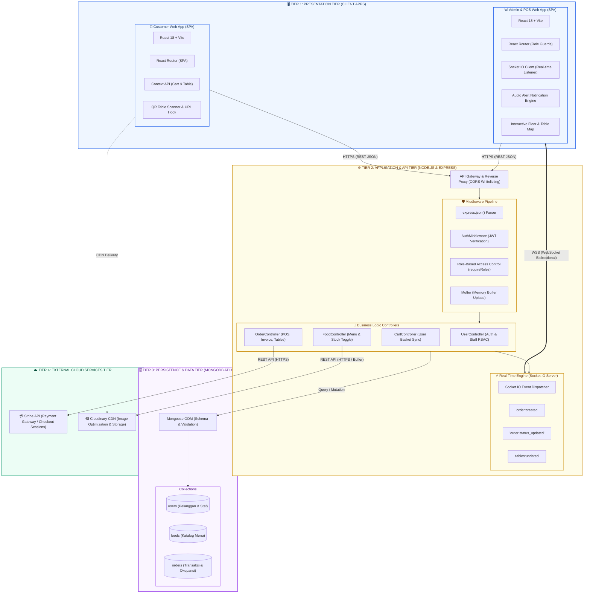
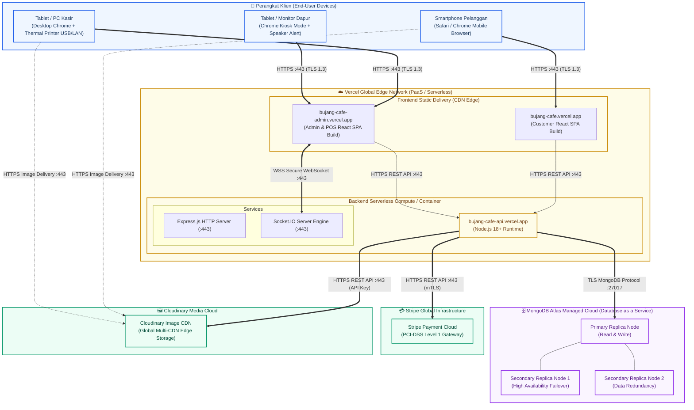

# DOKUMEN ARSITEKTUR SISTEM & SPESIFIKASI INFRASTRUKTUR
## SISTEM APLIKASI PEMESANAN MENU & POS RESTORAN (BUJANG CAFE)

---

### Informasi Dokumen
- **Judul Proyek**: Sistem Informasi Pemesanan Menu Digital & Point of Sale (POS) Bujang Cafe
- **Penyusun**: Mahasiswa Tugas Akhir
- **Standar Arsitektur**: Multi-Tier Client-Server Architecture, Event-Driven Architecture (EDA), & UML 2.5 Deployment Standard
- **Tingkat Diagram**: High-Level System Architecture, Real-Time Event Bus, Data Pipeline, & Cloud Deployment Topology
- **Tanggal Rilis**: 27 September 2026
- **Status**: Final Disetujui

---

## 1. PENDAHULUAN

Arsitektur sistem mendefinisikan struktur fundamental, komponen perangkat lunak, subsistem perangkat keras, mekanisme komunikasi, serta pola interaksi yang membentuk sebuah solusi teknologi secara holistik. 

Sistem **Bujang Cafe POS & Restoran** dirancang menggunakan pendekatan modern yang menggabungkan:
1. **Multi-Tier Client-Server Architecture**: Memisahkan lapisan antarmuka pengguna (*Presentation Tier*), pemrosesan logika bisnis (*Application/API Tier*), penyimpanan basis data (*Persistence Tier*), dan layanan pihak ketiga (*Cloud Service Tier*).
2. **Event-Driven Architecture (EDA) Real-Time**: Menggunakan WebSocket bi-direksional via **Socket.IO** untuk menyinkronkan status pesanan dan okupansi meja secara instan tanpa memerlukan *polling* berkala.
3. **Decoupled Single Page Application (SPA)**: Memisahkan antarmuka pelanggan (*Customer Frontend*) dan antarmuka staf/operasional (*Admin & POS Panel*) yang masing-masing dibangun dengan React dan Vite.
4. **Cloud-Native Deployment**: Memanfaatkan infrastruktur awan berbasis serverless/edge network untuk frontend dan backend, basis data terdistribusi MongoDB Atlas, CDN Cloudinary untuk media, serta Stripe Payment Gateway untuk transaksi nontunai.

---

## 2. DIAGRAM 1: ARSITEKTUR SISTEM MULTI-TIER (HIGH-LEVEL ARCHITECTURE)

Diagram berikut menggambarkan 4 tingkatan (*tiers*) logis dari sistem Bujang Cafe beserta protokol komunikasi data yang menghubungkannya.



---

## 3. DIAGRAM 2: ARSITEKTUR REAL-TIME EVENT-DRIVEN (SOCKET.IO)

Salah satu keunggulan arsitektur sistem Bujang Cafe adalah integrasi **Event-Driven Architecture (EDA)**. Setiap perubahan status transaksi, pelunasan pembayaran, maupun pengosongan meja disiarkan secara *instant push* tanpa memerlukan *polling HTTP* yang boros kuota dan membebani server.

```mermaid
sequenceDiagram
    autonumber
    actor Pelanggan as 👤 Pelanggan (Smartphone)
    participant FeCust as 📱 Customer Web App
    participant Backend as ⚙️ Express Backend API
    participant SocketServer as ⚡ Socket.IO Server
    participant FeKasir as 💁 Layar Kasir (POS)
    participant FeDapur as 👨‍🍳 Layar Dapur (Kitchen)
    database MongoDB as 🗄️ MongoDB Atlas

    Note over Pelanggan,FeCust: Tamu memesan makanan di Meja 3
    Pelanggan->>FeCust: Checkout Tunai / Selesai Stripe
    FeCust->>Backend: POST /api/order/manual atau /verify
    Backend->>MongoDB: Simpan Dokumen Order (M-XXXX / E-XXXX)
    
    Note over Backend,SocketServer: Memicu Sinyal Broadcast Otomatis
    Backend->>SocketServer: io.emit('order:created', orderPayload)
    Backend->>SocketServer: io.emit('tables:updated')

    par Notifikasi Kasir & Dapur Simultan
        SocketServer-->>FeKasir: Event 'order:created' & 'tables:updated'
        Note over FeKasir: Suara 'Ding!' berbunyi, Kartu Meja 3 berubah Kuning
        SocketServer-->>FeDapur: Event 'order:created'
        Note over FeDapur: Tiket baru muncul di antrean masak dapur
    end

    Note over FeDapur,Backend: Dapur mulai memasak hidangan
    FeDapur->>Backend: POST /api/order/status (status: 'Diproses')
    Backend->>MongoDB: Update status='Diproses', payment=true
    Backend->>SocketServer: io.emit('order:status_updated', {status: 'Diproses'})
    SocketServer-->>FeCust: Status pesanan berubah menjadi 'Sedang Dimasak' 🍳

    Note over FeDapur,Backend: Makanan disajikan ke meja tamu
    FeDapur->>Backend: POST /api/order/status (status: 'Disajikan')
    Backend->>MongoDB: Update status='Disajikan'
    Backend->>SocketServer: io.emit('order:status_updated', {status: 'Disajikan'})
    Backend->>SocketServer: io.emit('tables:updated')
    SocketServer-->>FeKasir: Kartu Meja 3 berubah Biru (Makan/Dining) + Timer Jalan

    Note over FeKasir,Backend: Tamu selesai makan, Kasir klik 'Kosongkan Meja'
    FeKasir->>Backend: POST /api/order/status (status: 'Selesai')
    Backend->>MongoDB: Update status='Selesai' (Arsipkan ke Riwayat)
    Backend->>SocketServer: io.emit('tables:updated')
    SocketServer-->>FeKasir: Kartu Meja 3 seketika menjadi Hijau (Available) 🧹
```

### Event Payload Dictionary
| Nama Event Socket | Arah Aliran | Pemicu (*Trigger*) | Dampak pada Klien |
| :--- | :---: | :--- | :--- |
| `order:created` | Server → All Staff | Pesanan baru berhasil dibuat oleh pelanggan atau kasir. | Memutar file audio alert (`alert.mp3`), menambahkan tiket ke daftar pesanan, membarui badge total pesanan aktif. |
| `order:status_updated`| Server → All Clients| Perubahan status (`Diproses`, `Disajikan`, `Selesai`). | Layar pelanggan memperbarui tracker pesanan; layar kasir & dapur memperbarui status tiket. |
| `order:payment_updated`| Server → Kasir & Admin| Pelunasan tunai berhasil dikonfirmasi kasir. | Mengubah label status pembayaran tiket dari merah (*Belum Bayar*) ke hijau (*Lunas*). |
| `tables:updated` | Server → Kasir & Admin| Setiap ada pesanan masuk, perubahan status, atau pengosongan meja. | Memperbarui denah okupansi 20 meja kasir secara langsung tanpa *reload* halaman. |
| `order:deleted` | Server → All Staff | Pembatalan pesanan berstatus *Pending*. | Menghapus kartu pesanan dari antrean dapur dan kasir secara langsung. |

---

## 4. DIAGRAM 3: ALIRAN DATA TRANSAKSI & PIPELINE BISNIS

Diagram alur data (*Data Flow Architecture*) ini memetakan bagaimana data ditransformasikan dari representasi di antarmuka pelanggan menjadi dokumen terstruktur di basis data.

```mermaid
flowchart LR
    subgraph INPUT ["1. Masukan Pengguna"]
        IN1["QR Parameter: ?table=X"]
        IN2["Keranjang: [{foodId, qty}]"]
        IN3["Voucher: 'MERDEKA' (-30%)"]
    end

    subgraph LOGIC ["2. Pemrosesan Logika Bisnis (Express API)"]
        direction TB
        L1["Validasi Token & Nomor Meja"]
        L2["Kalkulasi Total Bersih:<br/>Amount = (Subtotal - Diskon)"]
        L3["Format Invoice Unik:<br/>E-YYYYMMDD-XXXX (Online)<br/>M-YYYYMMDD-XXXX (Tunai)"]
    end

    subgraph PERSISTENCE ["3. Penyimpanan & State Basis Data"]
        direction TB
        P1["Dokumen Pesanan Baru di MongoDB:"]
        P2["- userId (FK Pengguna)<br/>- items (Array Snapshot Harga)<br/>- tableNumber: 3<br/>- status: 'Pending'/'Diproses'<br/>- payment: false/true<br/>- invoiceNumber"]
        P3["Kosongkan cartData Pengguna: {}"]
    end

    subgraph DISPATCH ["4. Luaran & Sinkronisasi Sistem"]
        OUT1["Sesi Stripe Checkout (Jika Online)"]
        OUT2["Tiket POS Kasir & Struk Thermal"]
        OUT3["Pemberitahuan Audio & Antrean Dapur"]
        OUT4["Denah Okupansi Meja Real-time"]
    end

    INPUT --> LOGIC
    LOGIC --> PERSISTENCE
    PERSISTENCE --> DISPATCH

    %% Styling
    classDef inStyle fill:#eff6ff,stroke:#2563eb,stroke-width:2px,color:#1e3a5f;
    classDef logStyle fill:#fefce8,stroke:#ca8a04,stroke-width:2px,color:#713f12;
    classDef dbStyle fill:#faf5ff,stroke:#9333ea,stroke-width:2px,color:#581c87;
    classDef outStyle fill:#ecfdf5,stroke:#059669,stroke-width:2px,color:#064e3b;
    class INPUT inStyle;
    class LOGIC logStyle;
    class PERSISTENCE dbStyle;
    class DISPATCH outStyle;
```



---

## 5. DIAGRAM 4: UML DEPLOYMENT DIAGRAM (TOPOLOGI CLOUD & INFRASTRUKTUR)

Diagram ini menggambarkan arsitektur fisik dan topologi komputasi awan (*cloud deployment topology*), perangkat keras klien, node eksekusi serverless/hosting, komunikasi port, dan sertifikasi keamanan transport.



---

## 6. ANALISIS ATRIBUT KUALITAS SISTEM (SOFTWARE QUALITY ATTRIBUTES / NFR)

Perancangan arsitektur sistem Bujang Cafe secara cermat mempertimbangkan kebutuhan non-fungsional (*Non-Functional Requirements*) untuk menjamin keandalan pada lingkungan operasional nyata restoran:

### 6.1 Keamanan (*Security*)
1. **Autentikasi Tanpa Sesi (Stateless JWT)**: Menggunakan token bertanda tangan kriptografis dengan rahasia `JWT_SECRET`. Token menyematkan identitas akun pengguna dan peran hak akses (*role*).
2. **Role-Based Access Control (RBAC)**: Middleware `requireRoles('manager', 'kasir')` diterapkan secara granular. Percobaan staf biasa mengakses endpoint sensitif seperti penghapusan menu atau laporan keuntungan otomatis ditolak dengan kode `403 Forbidden`.
3. **Penyimpanan Kredensial Terenkripsi**: Kata sandi di-hash menggunakan algoritma *Bcrypt* dengan salt factor 10, sehingga menjamin kata sandi asli tidak pernah tersimpan dalam bentuk teks biasa (*plain text*).
4. **CORS Whitelisting**: Konfigurasi `isOriginAllowed` di backend hanya mengizinkan lalu lintas dari domain terdaftar (Vercel production URL, domain lokal pengujian, dan protokol internal).
5. **Kepatuhan Transaksi Finansial**: Transaksi kartu kredit didelegasikan sepenuhnya ke Stripe Checkout berstandar **PCI-DSS Level 1**, sehingga server restoran tidak menyimpan nomor kartu kredit pelanggan secara langsung.

### 6.2 Performa & Latensi Rendah (*Performance & Low Latency*)
1. **Pembaruan Meja < 100ms via WebSocket**: Sinyal perubahan status meja disiarkan seketika melalui koneksi tetap (*persistent connection*) Socket.IO, mengeliminasi beban latensi *HTTP polling*.
2. **Optimasi Kueri MongoDB (`.lean()`)**: Endpoint krusial seperti `/api/order/tables` dan ringkasan badge pesanan aktif menggunakan flag `.lean()` dan seleksi atribut parsial (`.select('tableNumber status amount date invoiceNumber')`), menurunkan waktu respons query dari 27 detik menjadi **< 60 ms**.
3. **Penyimpanan Aset Statis pada CDN**: Foto katalog menu dihosting di CDN global Cloudinary dengan kompresi cerdas dan pengalihan format otomatis (*WebP/AVIF*), mempercepat proses muat katalog menu di smartphone pelanggan.

### 6.3 Skalabilitas & Ketersediaan (*Scalability & High Availability*)
1. **Database Replica Sets**: MongoDB Atlas beroperasi pada konfigurasi klaster 3-node (1 Primary, 2 Secondary) dengan kemampuan pemulihan otomatis (*automated failover*) jika terjadi kendala pada node utama.
2. **Stateless API Backend**: Arsitektur REST API backend tidak menyimpan status sesi di memori server, memungkinkan server backend diskalakan secara horizontal (*auto-scale*) mengikuti lonjakan transaksi jam makan siang/malam.

### 6.4 Integritas Data Transaksi (*Data Integrity*)
1. **Proteksi Penghapusan Transaksi**: Endpoint `deleteOrder` secara ketat melarang penghapusan pesanan yang sudah diproses, disajikan, atau dibayar (`status !== 'Pending'`). Hal ini menjaga agar data buku besar dan rekapitulasi keuangan kasir tidak dapat dimanipulasi.
2. **Penomoran Faktur Ganda Unik**: Setiap pesanan diberikan nomor invoice standar:
   - `E-YYYYMMDD-XXXX` untuk transaksi elektronik online (Stripe).
   - `M-YYYYMMDD-XXXX` untuk transaksi manual/tunai di kasir.
3. **Fitur Pengosongan Meja 1-Click & Undo**: Pengosongan meja menandai seluruh pesanan aktif pada meja terkait menjadi `Selesai` secara serentak di basis data, dengan jendela waktu pemulihan (*Undo*) selama 5 detik jika kasir melakukan kesalahan klik.

---

## 7. MATRIKS KETERHUBUNGAN DOKUMEN REKAYASA PERANGKAT LUNAK TUGAS AKHIR

Dokumen Arsitektur Sistem ini melengkapi kesatuan pilar dokumentasi rekayasa perangkat lunak sistem Bujang Cafe:

| Dokumen | Lokasi Berkas | Peran dalam Dokumen Tugas Akhir |
| :--- | :--- | :--- |
| **Arsitektur Sistem** | **[SYSTEM_ARCHITECTURE.md](file:///d:/College/Tugas%20Sopiansyah/Tugas%20Akhir/menu-ordering-app-deploy/SYSTEM_ARCHITECTURE.md)** | **Topologi infrastruktur, arsitektur multi-tier, event-driven Socket.IO, dan atribut kualitas (NFR).** |
| **Activity Diagram** | **[ACTIVITY_DIAGRAM.md](file:///d:/College/Tugas%20Sopiansyah/Tugas%20Akhir/menu-ordering-app-deploy/ACTIVITY_DIAGRAM.md)** | **Alur kerja dinamis & 4 diagram alir swimlane (Pelanggan, Dapur, Kasir, Manajer).** |
| **Class Diagram** | **[CLASS_DIAGRAM.md](file:///d:/College/Tugas%20Sopiansyah/Tugas%20Akhir/menu-ordering-app-deploy/CLASS_DIAGRAM.md)** | **Struktur data statis, relasi komposisi Order, skema Mongoose & kelas MVC Express.** |
| **Use Case Diagram** | **[USE_CASE_DIAGRAM.md](file:///d:/College/Tugas%20Sopiansyah/Tugas%20Akhir/menu-ordering-app-deploy/USE_CASE_DIAGRAM.md)** | **Spesifikasi kebutuhan fungsional 28 use case dan 4 aktor pengguna.** |
| **Black Box Testing Admin** | **[BLACK_BOX_TESTING_ADMIN.md](file:///d:/College/Tugas%20Sopiansyah/Tugas%20Akhir/menu-ordering-app-deploy/BLACK_BOX_TESTING_ADMIN.md)** | **Pengujian fungsional panel admin & kasir (84 test cases mencakup fitur Kosongkan Meja).** |
| **Black Box Testing Customer** | **[BLACK_BOX_TESTING_CUSTOMER.md](file:///d:/College/Tugas%20Sopiansyah/Tugas%20Akhir/menu-ordering-app-deploy/BLACK_BOX_TESTING_CUSTOMER.md)** | **Pengujian fungsional aplikasi pelanggan (54 test cases).** |
| **Laporan Uji Otomatis** | **[tests/reports/index.html](file:///d:/College/Tugas%20Sopiansyah/Tugas%20Akhir/menu-ordering-app-deploy/tests/reports/index.html)** | **Bukti empiris pengujian otomatis (55/55 test case passed, 100%).** |
