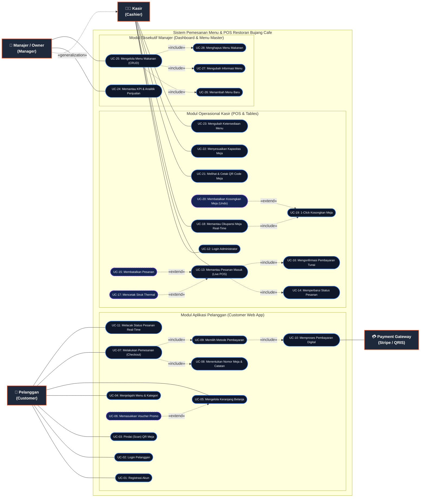

# DOKUMEN USE CASE DIAGRAM & SPESIFIKASI SISTEM
## SISTEM APLIKASI PEMESANAN MENU & POS RESTORAN (BUJANG CAFE)

---

### Informasi Dokumen
- **Judul Proyek**: Sistem Informasi Pemesanan Menu Digital & Point of Sale (POS) Bujang Cafe
- **Penyusun**: Mahasiswa Tugas Akhir
- **Standar Pemodelan**: Unified Modeling Language (UML 2.5)
- **Tingkat Diagram**: Terpadu (Unified System Boundary)
- **Tanggal Rilis**: 27 September 2026
- **Status**: Final Disetujui

---

## 1. PENDAHULUAN

Use Case Diagram ini memodelkan fungsionalitas dan interaksi antara aktor (pengguna eksternal dan sistem eksternal) dengan batasan sistem (*system boundary*) pada aplikasi **Bujang Cafe**. Sistem terbagi menjadi 2 komponen utama yang saling terintegrasi secara *real-time*:
1. **Aplikasi Pemesanan Pelanggan (Customer Web App)**: Digunakan oleh pengunjung kafe untuk melihat menu, memilih nomor meja via QR code, memesan makanan/minuman, menerapkan kode promo, dan melacak status sajian secara mandiri (*self-service ordering*).
2. **Panel Kasir & Manajemen (Admin & POS Panel)**: Digunakan oleh kasir dan manajer untuk menerima pesanan secara *real-time* via WebSockets (Socket.IO), memproses pembayaran tunai, memantau okupansi meja makan, mencetak struk thermal POS & stand akrilik QR meja, serta analisis KPI bisnis.

---

## 2. IDENTIFIKASI AKTOR

| No | Aktor | Tipe | Peran & Tanggung Jawab Utama |
| :-: | :--- | :---: | :--- |
| **1** | **Pelanggan** (*Customer*) | Aktor Primer (*Human*) | Pengunjung kafe yang memindai QR meja, memilih menu, melakukan pemesanan mandiri, menerapkan voucher promo, memilih metode pembayaran, dan melacak status hidangan. |
| **2** | **Kasir** (*Cashier*) | Aktor Primer (*Human*) | Staf operasional yang memverifikasi pesanan masuk, mengonfirmasi penerimaan uang tunai, memperbarui progres dapur (*Dimasak → Disajikan → Selesai*), mengosongkan meja makan, mencetak nota transaksi, dan mengubah ketersediaan stok menu. |
| **3** | **Manajer / Owner** (*Manager*) | Aktor Primer (*Human*) | Pengelola restoran yang mewarisi (*generalization*) seluruh hak akses Kasir, ditambah hak istimewa (*privilege*) untuk memantau dashboard analitik bisnis (omzet, AOV, tren jam sibuk) dan manajemen CRUD katalog menu restoran. |
| **4** | **Payment Gateway** (*Stripe*) | Aktor Sekunder (*External System*) | Layanan pihak ketiga eksternal yang memproses transaksi kartu debit/kredit dan metode pembayaran elektronik lainnya serta mengirimkan verifikasi status pembayaran ke backend. |

---

## 3. USE CASE DIAGRAM (VISUALISASI UML MERMAID)

Diagram di bawah ini digambarkan menggunakan standar UML 2.5 lengkap dengan relasi asosiasi, generalisasi aktor (*inheritance*), serta relasi dependensi `<<include>>` dan `<<extend>>`.

---

## 4. MATRIKS SPESIFIKASI USE CASE DETAIL

### 4.1 Modul Aplikasi Pelanggan (*Customer*)

#### UC-01: Registrasi Akun Pelanggan
- **Aktor Utama**: Pelanggan
- **Tujuan**: Mendaftarkan akun baru pelanggan ke dalam sistem.
- **Kondisi Awal (*Pre-condition*)**: Pelanggan belum login dan berada pada aplikasi.
- **Skenario Utama (*Happy Path*)**:
  1. Pelanggan menekan tombol "Sign In" pada navbar dan memilih opsi "Sign Up".
  2. Sistem menampilkan formulir registrasi (Nama, Email, Password).
  3. Pelanggan mengisi formulir dengan data yang valid (password min. 8 karakter).
  4. Pelanggan menekan tombol daftar.
  5. Sistem memvalidasi data, melakukan *hashing* password via bcrypt, menyimpan akun ke database, dan menghasilkan token JWT.
  6. Sistem otomatis memasukkan sesi pelanggan (*auto-login*) dan menutup formulir modal.
- **Kondisi Akhir (*Post-condition*)**: Akun terdaftar dan tersimpan di database; token tersimpan di browser.

---

#### UC-02: Login Pelanggan
- **Aktor Utama**: Pelanggan
- **Tujuan**: Mengautentikasi identitas pelanggan untuk mengakses riwayat dan keranjang tersinkronisasi.
- **Kondisi Awal**: Pelanggan telah memiliki akun terdaftar.
- **Skenario Utama**:
  1. Pelanggan membuka pop-up Login.
  2. Pelanggan memasukkan email dan kata sandi.
  3. Sistem memverifikasi kredensial.
  4. Sistem memberikan respons token JWT dan menyinkronkan keranjang dari database.
- **Kondisi Alternatif**: Jika email atau kata sandi tidak cocok, sistem menampilkan pesan error peringatan.

---

#### UC-03: Pindai (Scan) QR Meja
- **Aktor Utama**: Pelanggan
- **Tujuan**: Menghubungkan sesi pemesanan langsung ke nomor meja fisik pelanggan.
- **Kondisi Awal**: Pelanggan berada di meja restoran dan memindai QR code akrilik di meja.
- **Skenario Utama**:
  1. Kamera ponsel membaca tautan URL meja (contoh: `https://bujang-cafe.vercel.app/?table=5`).
  2. Aplikasi mem-parsing parameter `table` dari URL query.
  3. Sistem menyimpan nomor meja di context dan `localStorage`.
  4. Navbar menampilkan indikator aktif: `"Meja 5"`.
- **Kondisi Akhir**: Nomor meja otomatis terikat pada setiap transaksi pemesanan berikutnya.

---

#### UC-04: Menjelajahi Menu & Filter Kategori
- **Aktor Utama**: Pelanggan
- **Tujuan**: Melihat daftar makanan/minuman yang tersedia beserta harga dan deskripsi.
- **Skenario Utama**:
  1. Pelanggan membuka halaman utama atau mengklik tautan "Menu".
  2. Sistem menampilkan carousel menu promo dan daftar kategori (Salad, Rolls, Deserts, Sandwich, Cake, Pure Veg, Pasta, Noodles).
  3. Pelanggan memilih salah satu kategori menu.
  4. Sistem memfilter daftar makanan secara instan sesuai kategori yang dipilih.
  5. Jika suatu menu berstatus "Stok Habis" (*unavailable*), sistem menampilkan tanda visual non-aktif.

---

#### UC-05: Mengelola Keranjang Belanja (*Cart*)
- **Aktor Utama**: Pelanggan
- **Tujuan**: Memilih jumlah porsi hidangan yang akan dipesan.
- **Skenario Utama**:
  1. Pelanggan menekan tombol "+" pada kartu makanan.
  2. Sistem menambah item ke keranjang dan memperbarui badge jumlah porsi di navbar/floating FAB.
  3. Pelanggan dapat membuka halaman `/cart` untuk menambah, mengurangi, atau menghapus item.
  4. Sistem otomatis mengkalkulasi subtotal secara dinamis.
- **Relasi Extend**:
  - `<<extend>>` **UC-06: Memasukkan Voucher Promo**: Pelanggan dapat memasukkan kode promo `MERDEKA` (potongan 30%) atau `SPECIAL20` (potongan 20%) untuk memotong total pembayaran.

---

#### UC-07: Melakukan Pemesanan (*Checkout Order*)
- **Aktor Utama**: Pelanggan
- **Tujuan**: Mengirimkan pesanan resmi ke dapur/kasir restoran.
- **Relasi Include**:
  - `<<include>>` **UC-08: Menentukan Nomor Meja & Catatan**: Sistem mewajibkan pengisian nomor meja dan catatan khusus (misal: "Jangan pedas").
  - `<<include>>` **UC-09: Memilih Metode Pembayaran**: Pelanggan memilih "Pembayaran Tunai" atau "Pembayaran Elektronik".
- **Skenario Utama (Tunai di Kasir)**:
  1. Pelanggan memilih opsi Tunai dan menekan "Buat Pesanan".
  2. Sistem membuat dokumen order baru dengan status `"Pending"` dan nomor invoice otomatis berawalan `M-YYYYMMDD-XXXX`.
  3. Sistem memancarkan event `order:created` melalui WebSocket Socket.IO ke layar kasir.
  4. Keranjang belanja pelanggan dikosongkan.
  5. Sistem mengarahkan pelanggan ke halaman konfirmasi pesanan `/order-confirmation/:orderId`.
- **Skenario Alternatif (Elektronik via Stripe)**:
  1. Pelanggan memilih pembayaran elektronik.
  2. Sistem berinteraksi dengan **Payment Gateway (Stripe)** untuk membuat sesi checkout online.
  3. Pelanggan menyelesaikan pembayaran kartu dan diarahkan kembali ke aplikasi (`/verify?success=true`).

---

#### UC-11: Melacak Status Pesanan Real-Time
- **Aktor Utama**: Pelanggan
- **Tujuan**: Memantau progres hidangan yang sedang dipersiapkan oleh pihak restoran.
- **Skenario Utama**:
  1. Pelanggan membuka menu "Pesanan Saya" (`/myorders`).
  2. Sistem menampilkan daftar pesanan aktif dan selesai/dibatalkan.
  3. Pelanggan melihat lencana status terkini:
     - `Pending`: Menunggu konfirmasi kasir
     - `Dimasak`: Makanan sedang dimasak di dapur
     - `Disajikan`: Makanan telah diantar ke meja
     - `Selesai`: Tamu telah selesai makan & pembayaran lunas
     - `Dibatalkan`: Pesanan dibatalkan oleh kasir

---

### 4.2 Modul Operasional Kasir (*Cashier / POS*)

#### UC-12: Login Administrator
- **Aktor Utama**: Kasir, Manajer
- **Tujuan**: Mengamankan akses staf restoran ke modul POS dan administrasi.
- **Skenario Utama**:
  1. Staf membuka rute `/login` pada admin panel.
  2. Staf memasukkan email (`kasir@bujangcafe.com` / `manager@bujangcafe.com`) dan password.
  3. Sistem memverifikasi peran (*role*).
  4. Jika peran `kasir`, sistem otomatis mengarahkan ke halaman POS Semua Pesanan (`/orders`).
  5. Jika peran `manager`, sistem mengarahkan ke halaman Dashboard KPI (`/dashboard`).

---

#### UC-13: Memantau Pesanan Masuk (*Live POS Orders*)
- **Aktor Utama**: Kasir, Manajer
- **Tujuan**: Menerima dan memproses seluruh alur transaksi pesanan secara terpusat.
- **Relasi**:
  - `<<include>>` **UC-14: Memperbarui Status Pesanan**: Kasir mengubah status pesanan dari *Pending → Dimasak → Disajikan → Selesai*.
  - `<<include>>` **UC-16: Mengonfirmasi Pembayaran Tunai**: Kasir menandai status pembayaran pesanan menjadi `"Lunas"`.
  - `<<extend>>` **UC-15: Membatalkan Pesanan**: Kasir membatalkan pesanan yang salah pesan/habis dengan konfirmasi interaktif.
  - `<<extend>>` **UC-17: Mencetak Struk Thermal**: Kasir mencetak struk kasir fisik 58mm/80mm ke printer thermal POS.

---

#### UC-18: Memantau Okupansi Meja Real-Time (*Table Management*)
- **Aktor Utama**: Kasir, Manajer
- **Tujuan**: Memantau status setiap meja kafe (Kosong, Menunggu, Diproses, Disajikan) dalam bentuk grid visual interaktif.
- **Relasi**:
  - `<<include>>` **UC-19: 1-Click Kosongkan Meja**: Ketika pelanggan telah meninggalkan kafe, kasir menekan tombol "Kosongkan Meja" pada kartu meja. Sistem secara otomatis menyelesaikan seluruh pesanan aktif terkait meja tersebut dan mereset status meja menjadi bersih/tersedia.
  - `<<extend>>` **UC-20: Membatalkan Kosongkan Meja (Undo)**: Toast notifikasi memunculkan tombol "Urungkan" selama 5 detik jika terjadi salah klik.
  - `<<include>>` **UC-21: Melihat & Cetak QR Code Meja**: Kasir membuka modal stand akrilik meja untuk melihat atau mencetak QR code meja dan QR Wi-Fi.
  - `<<include>>` **UC-22: Menyesuaikan Kapasitas Meja**: Kasir dapat menambah/mengurangi jumlah total meja operasional menggunakan tombol stepper (+ / -).

---

#### UC-23: Mengubah Ketersediaan Menu
- **Aktor Utama**: Kasir, Manajer
- **Tujuan**: Mematikan menu yang bahannya telah habis agar tidak dapat dipesan oleh pelanggan.
- **Skenario Utama**:
  1. Kasir membuka halaman daftar menu (`/list`).
  2. Kasir menekan tombol saklar (*switch*) ketersediaan pada menu terkait.
  3. Sistem mengubah atribut `available` (True/False) di database.
  4. Aplikasi pelanggan secara instan menonaktifkan tombol pemesanan untuk menu tersebut.

---

### 4.3 Modul Eksekutif Manajer (*Manager*)

#### UC-24: Memantau KPI & Analitik Penjualan (*Executive Dashboard*)
- **Aktor Utama**: Manajer / Owner
- **Tujuan**: Mengambil keputusan strategis bisnis berdasarkan data empiris restoran.
- **Skenario Utama**:
  1. Manajer membuka halaman `/dashboard`.
  2. Sistem mengkalkulasi dan menyajikan metrik bisnis utama (*The Golden Triad*):
     - Total Omzet Penjualan (Revenue)
     - Total Volume Transaksi Pemesanan
     - Rata-rata Nilai Transaksi per Pelanggan (*Average Order Value / AOV*)
  3. Manajer memilih filter rentang waktu: *Hari Ini, 7 Hari Terakhir, 30 Hari Terakhir, Bulan Ini, atau Rentang Kustom*.
  4. Sistem merender grafik tren penjualan interaktif (Mode Garis / Mode Batang).
  5. Sistem menampilkan tabel peringkat 5 menu terlaris (*Top Selling Foods*).

---

#### UC-25: Mengelola Menu Makanan (*CRUD Food Master*)
- **Aktor Utama**: Manajer / Owner
- **Tujuan**: Mengatur katalog hidangan yang dijual oleh restoran Bujang Cafe.
- **Proteksi Keamanan (RBAC)**: Dibatasi hanya untuk peran `manager` dan `admin`; peran `kasir` atau `customer` yang mencoba mengakses endpoint ini ditolak dengan kode status HTTP `403 Forbidden`.
- **Relasi**:
  - `<<include>>` **UC-26: Menambah Menu Baru**: Menginput nama, deskripsi, harga, kategori, dan mengunggah gambar makanan ke penyimpanan awan Cloudinary.
  - `<<include>>` **UC-27: Mengubah Informasi Menu**: Memperbarui harga atau deskripsi makanan lama.
  - `<<include>>` **UC-28: Menghapus Menu Makanan**: Menghapus item makanan dari katalog sistem secara permanen.

---

## 5. RANGKUMAN KETERHUBUNGAN DOKUMEN SISTEM

Dokumen Use Case Diagram ini menjadi acuan fungsional utama yang melengkapi dokumen pengujian yang telah teruji:
1. **[USE_CASE_DIAGRAM.md](file:///d:/College/Tugas%20Sopiansyah/Tugas%20Akhir/menu-ordering-app-deploy/USE_CASE_DIAGRAM.md)**: Arsitektur use case dan spesifikasi fungsionalitas aktor.
2. **[BLACK_BOX_TESTING_CUSTOMER.md](file:///d:/College/Tugas%20Sopiansyah/Tugas%20Akhir/menu-ordering-app-deploy/BLACK_BOX_TESTING_CUSTOMER.md)**: 54 skenario pengujian manual fungsionalitas Pelanggan (UC-01 s/d UC-11).
3. **[BLACK_BOX_TESTING_ADMIN.md](file:///d:/College/Tugas%20Sopiansyah/Tugas%20Akhir/menu-ordering-app-deploy/BLACK_BOX_TESTING_ADMIN.md)**: 84 skenario pengujian manual fungsionalitas Kasir & Manajer (UC-12 s/d UC-28).
4. **[tests/reports/index.html](file:///d:/College/Tugas%20Sopiansyah/Tugas%20Akhir/menu-ordering-app-deploy/tests/reports/index.html)**: Hasil verifikasi otomatis 55 test case Jest & Playwright dengan tingkat kelulusan 100%.
